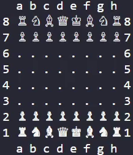

# ♟️ Terminal Chess Game (Python)

A simple chess game built using **pure Python** that runs entirely in the terminal.
This project focuses on **clarity, Unicode chess pieces, and beginner-friendly code**.

No GUI. No external libraries. Just Python.

---

## ✨ Features

- Unicode chess pieces
- Clean terminal board layout
- Turn-based gameplay (White / Black)
- Simple move input (`e2 e4`)
- Endless gameplay (no win condition)
- Easy to read and extend

---

## 📸 Preview



---

## 🚀 Getting Started

### Requirements
- Python 3.8 or higher

### Run the Game

```bash
python main.py
```

---

## 🎮 How to Play

Enter moves using chess notation:

```
e2 e4
```

Type `exit` to quit the game.

---

## 🧠 Learning Purpose

This project is useful for learning:

- 2D lists
- Functions
- Game loops
- Terminal output
- Unicode handling

---

## 🛠️ Future Improvements

- Move validation
- Check & checkmate
- Undo moves
- AI opponent
- GUI version

---

## 🤝 Contributing

Contributions are welcome.
Please read [CONTRIBUTING.md](CONTRIBUTING.md) before submitting changes.

---

## 📄 License

This project is licensed under the MIT License. See [LICENSE](LICENSE) for details.