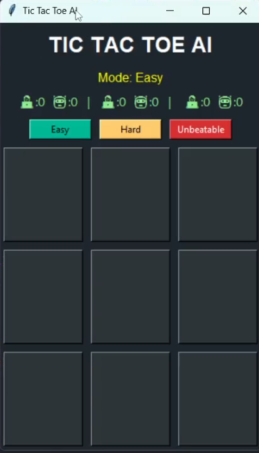

# Tic Tac Toe AI Game GUI

A classic Tic Tac Toe game with an AI opponent implemented in Python using Tkinter. Challenge yourself against three different difficulty levels: Easy, Hard, and Unbeatable.

## Features

- **Three Difficulty Modes**:
  - **Easy**: AI plays randomly
  - **Hard**: AI thinks one move ahead (wins or blocks)
  - **Unbeatable**: AI uses Minimax algorithm for perfect play
- **Graphical User Interface**: Clean, modern GUI with Tkinter
- **Score Tracking**: Keeps track of wins for each mode
- **Player vs AI**: You play as X (Blue), AI plays as O (Red)
- **Game Reset**: Option to play again after each game

## Requirements

- Python 3.x (Tkinter is included by default)

## Installation

1. Clone or download the repository.
2. Ensure Python 3.x is installed on your system.
3. No additional dependencies are required as Tkinter comes with Python.

## Usage

Run the game by executing the `main.py` file:

```bash
python main.py
```

## How to Play

1. **Select Difficulty**: Choose from Easy, Hard, or Unbeatable mode using the buttons at the top.
2. **Make Your Move**: Click on an empty square to place your X (Blue).
3. **AI Responds**: The AI will automatically make its move as O (Red).
4. **Win Condition**: Get three X's in a row, column, or diagonal to win.
5. **Draw**: If the board fills up without a winner, it's a draw.
6. **Play Again**: After each game, choose to play again or exit.

## Modes Explanation

- **Easy Mode**: The AI selects moves completely at random. Great for beginners or casual play.
- **Hard Mode**: The AI looks one move ahead. It will win if possible or block your winning moves. More challenging but beatable.
- **Unbeatable Mode**: Uses the Minimax algorithm to evaluate all possible game states. The AI will never lose and will force a draw at worst. Perfect for testing your skills.

## 🎮 Game Screenshots




## Contributing

Feel free to fork the repository and submit pull requests for improvements or bug fixes.

## License

This project is open-source and available under the MIT License.